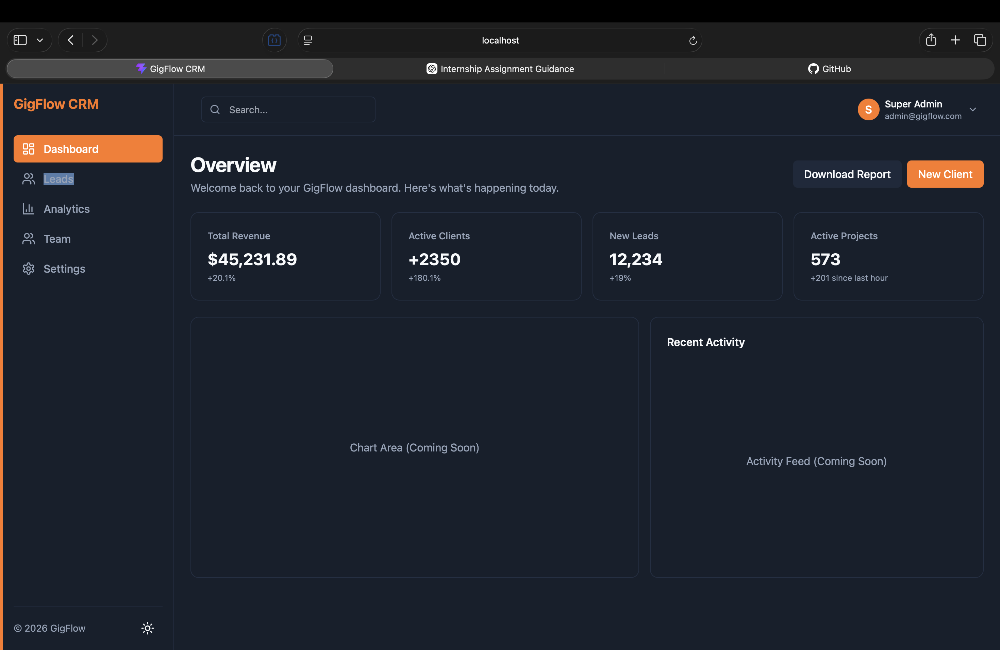
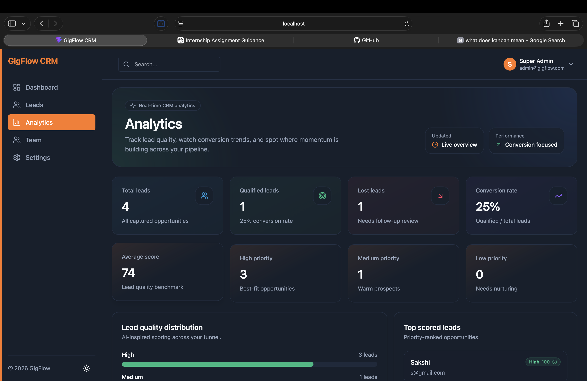
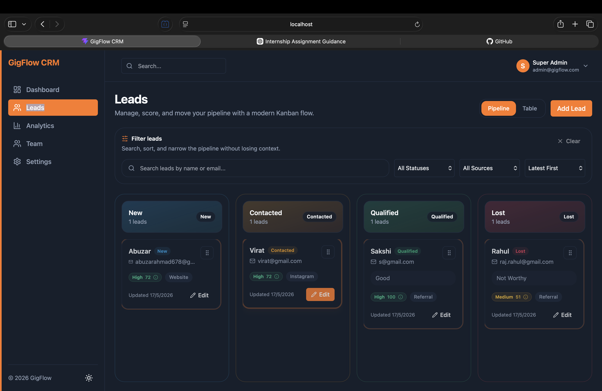
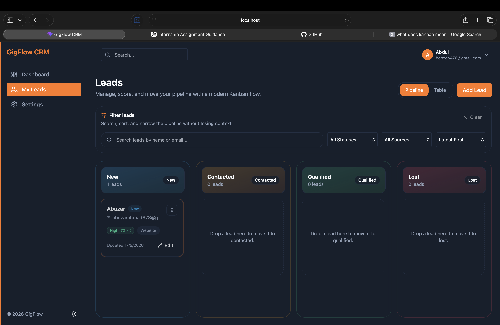
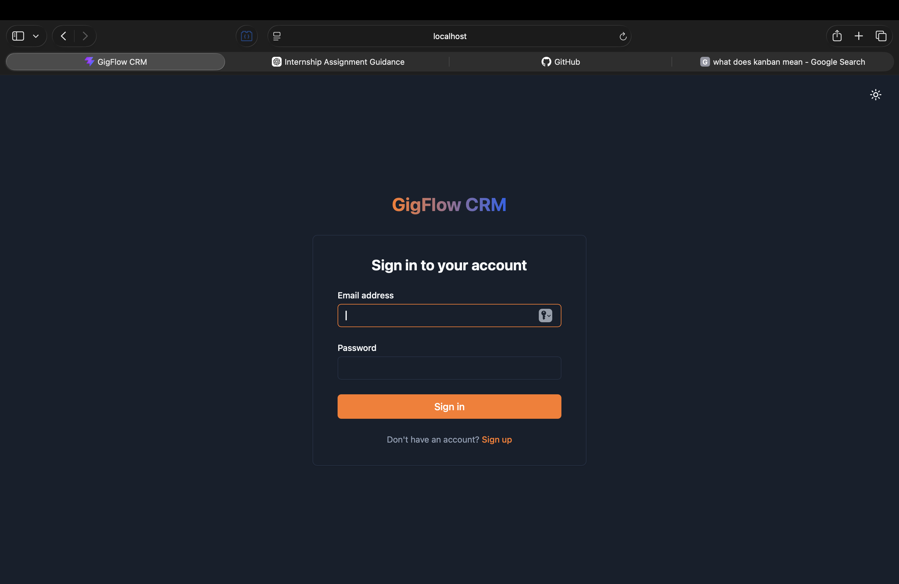
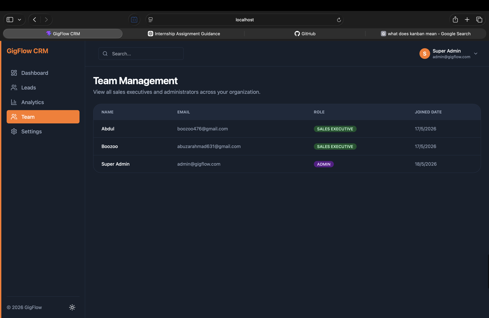

# 🚀 GigFlow CRM

> A modern, full-stack Customer Relationship Management platform built with React, Node.js, and MongoDB. GigFlow enables real-time lead management, Role-Based Access Control (RBAC), AI-inspired lead scoring, and visual Kanban pipelines to supercharge sales flow.


## 📋 Table of Contents

- [Overview](#overview)
- [System Architecture](#system-architecture)
- [Gallery & Screenshots](#gallery--screenshots)
- [Features](#features)
- [Tech Stack](#tech-stack)
- [Quick Start](#quick-start)
- [Project Structure](#project-structure)
- [Environment Variables](#environment-variables)
- [API Documentation](#api-documentation)

---

## 🎯 Overview

GigFlow CRM is a **production-ready customer relationship platform** designed to orchestrate sales teams efficiently. Through secure role-based environments, robust API scaling, and dynamic UI hydration, organizations can map leads across pipelines instantly. 

**Key Capabilities:**
- 📊 **Real-time pipeline orchestration** using drag-and-drop Kanban setups.
- 🔐 **Strict Role-Based Access Control (RBAC)** completely isolating Sales pipelines from Admin master views.
- 🤖 **Predictive AI-inspired lead scoring** calculating engagement patterns and metrics globally.
- 🔄 **Socket.IO-enabled live environments** syncing leads securely without manual refreshes.
- 🌓 **Aesthetically stunning SaaS themes** integrating 'Glassmorphism' traits & smooth dark mode transitions.

---

## 🏗 System Architecture

GigFlow strictly adopts a **Monorepo setup (Turborepo/NPM Workspaces)** seamlessly splitting operations securely:

- **Frontend (Client Layer)**: React + Vite application maintaining UI state tightly through Zustand. Requests are formatted and passed via Axios instances containing Bearer token persistence.
- **Backend (Service Layer)**: Express Server on Node.js utilizing extensive middleware configurations (Authentication verification, Payload validations via Zod schemas, error intercepts). 
- **Shared Layer**: A localized `@gigflow/shared` TS package enforces strict DTO formats, model typings (Interfaces), and critical utilities (such as our Lead Scoring matrix algorithm) spanning both server & client uniformly.
- **Persistence Layer**: MongoDB serving as the robust NoSQL backbone mapping relational documents tracking lead assignments to `assignedTo` users explicitly.

---

## 📸 Gallery & Screenshots

Here is a look at GigFlow CRM in action:

| **Admin Dashboard** | **Admin Analytics** |
|:---:|:---:|
|  |  |

| **Admin Leads Pipeline (All)** | **Sales Executive Pipeline (Isolated)** |
|:---:|:---:|
|  |  |

| **Authentication / Login** | **Team Management (Admin Only)** |
|:---:|:---:|
|  |  |

---

## ✨ Features

### Comprehensive Lead Orchestration
- ✅ Dedicated **Status Stages**: New → Contacted → Qualified → Lost.
- ✅ Granular data capturing from Social, Organic, and Referential tracking. 
- ✅ Interactive chronological Activity Timelines strictly mapping document histories.

### Strict Role-Based View Isolation
- ✅ **Admins:** High-level god view spanning the entire user infrastructure, unrestricted pipeline oversight, and global metrics.
- ✅ **Sales Executives:** Secure isolation strictly scoping interactions exclusively to explicitly assigned leads matching their `UUID`. 

### Analytics & Reporting
- ✅ Key-metrics generation detailing conversion health vs gross retention.
- ✅ Recharts integrated visualizations generating pie structures for origins and temporal bar charting.
- ✅ Global lead-distribution scales powered directly by our `ILeadScoreSummary` standard.

---

## 🛠 Tech Stack

### Frontend
- **Framework**: React 18 + Vite
- **Styling**: Tailwind CSS + Custom CSS Theme variables (Native Dark Mode compatibility)
- **State Management**: Zustand
- **Routing & Networking**: React Router DOM + Axios
- **Data Visualizations**: Recharts
- **Animations & Interaction**: Framer Motion, dnd-kit

### Backend
- **Runtime**: Node.js v20+
- **Framework**: Express.js
- **Database**: MongoDB 7 + Mongoose ORM
- **Security**: JSON Web Tokens (JWT), BCrypt password hashing, Strict API Error interceptors
- **Real-time Engine**: Socket.IO

### Package Tooling
- **Typing Engine**: TypeScript 5.0+
- **Validation**: Zod
- **Infrastructure**: NPM Workspaces (apps/frontend, apps/backend, packages/shared)

---

## 🚀 Quick Start

### Prerequisites
- Node.js 20+ and npm 10+
- MongoDB properly installed or an active Atlas Cluster URL.

### Local Development

1. **Clone and Install base:**
   ```bash
   git clone <repo-url>
   cd "GigFlow CRM"
   npm install
   ```

2. **Configure environments:**
   Define your database credentials and secret hashes in the targeted `/apps/backend/.env` structures manually or execute local standard ports.

3. **Start the System:**
   ```bash
   # Terminal 1: Backend Services
   npm run dev --prefix apps/backend
   
   # Terminal 2: Frontend Compilation
   npm run dev --prefix apps/frontend
   ```
4. Access platform securely via `http://localhost:5173`.

---

## 📁 Project Structure

```
GigFlow CRM/
├── apps/
│   ├── backend/              # Node.js Express instance
│   │   ├── src/
│   │   │   ├── controllers/  
│   │   │   ├── services/     
│   │   │   ├── models/       
│   │   │   ├── routes/       
│   │   │   ├── middlewares/  
│   │   │   └── config/       
│   └── frontend/             # React SPA Client
│       ├── src/
│       │   ├── components/   
│       │   ├── features/     # Feature-sliced modules 
│       │   ├── hooks/        
│       │   ├── lib/          
│       │   ├── store/        
│       │   └── routes/       
├── packages/
│   └── shared/               # Monorepo Shared standard package
│       ├── src/
│       │   ├── schemas/      # Zod validation standard formats
│       │   ├── types/        # Cross-stack Interface implementations
│       │   └── utils/        # Lead scoring matrix engine logic
│
└── apps/screenshots/         # Repo media directory
```

---

## 🔐 Environment Variables

### Backend Configuration Blueprint (`apps/backend/.env`)
```bash
NODE_ENV=development
PORT=5000
MONGO_URI=mongodb://localhost:27017/gigflow
JWT_SECRET=your-secure-development-secret-key-goes-here
CLIENT_URL=http://localhost:5173
```

### Frontend Configuration Blueprint (`apps/frontend/.env`)
```bash
VITE_API_URL=http://localhost:5000/api/v1
```

---

## 📄 License & Acknowledgments
Built to redefine Sales pipeline management seamlessly.
MIT License - see LICENSE file. 
Resources powered by Recharts, dnd-kit, and Tailwind CSS standardizations.

## API Documentation

Run the backend and open the interactive Swagger UI at `http://localhost:5000/api-docs`.
The raw OpenAPI JSON is available at `http://localhost:5000/api-docs.json`.
